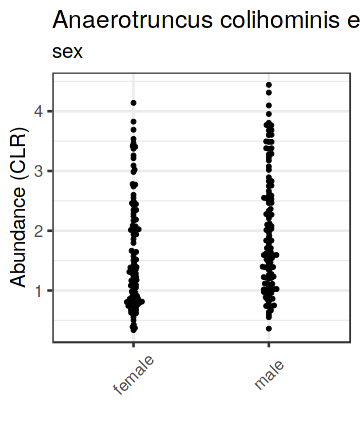
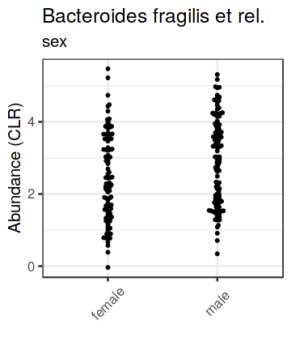
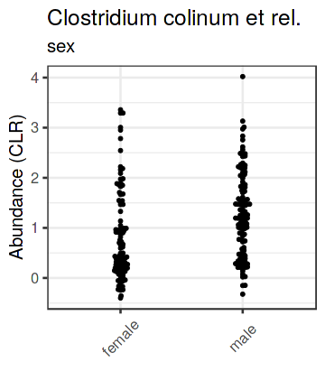

# ANCOM analysis

Significant taxa (regarding the grouping). Only the hits with adjusted p<0.25 are shown. Adjustment is done per group based on ANCOM defaults.

The log10 fold changes have been calculated from CLR-transformed abundances.

|OTU                                |Grouping    | pval.ancom| relab.cond| relab.control|    log10FC|
|:----------------------------------|:-----------|----------:|----------:|-------------:|----------:|
|Bacteroides vulgatus et rel.       |nationality |          0|       1.95|         18.05| -1.0514589|
|Bacteroides uniformis et rel.      |nationality |          0|       0.24|          1.38| -0.9104686|
|Allistipes et rel.                 |nationality |          0|       0.47|          3.54| -0.7969203|
|Bacteroides intestinalis et rel.   |nationality |          0|       0.02|          0.24| -0.7891129|
|Bacteroides ovatus et rel.         |nationality |          0|       0.21|          1.53| -0.7554616|
|Parabacteroides distasonis et rel. |nationality |          0|       0.31|          1.46| -0.7025511|
|Prevotella oralis et rel.          |nationality |          0|       5.72|          2.52|  0.6718835|
|Bacteroides plebeius et rel.       |nationality |          0|       0.12|          0.59| -0.5952976|
|Bacteroides fragilis et rel.       |nationality |          0|       0.85|          2.16| -0.5820670|
|Bacteroides stercoris et rel.      |nationality |          0|       0.06|          0.41| -0.5571033|
|Eubacterium biforme et rel.        |nationality |          0|       0.31|          0.14|  0.5543348|
|Megasphaera elsdenii et rel.       |nationality |          0|       0.53|          0.17|  0.4766201|
|Anaerostipes caccae et rel.        |nationality |          0|       0.22|          0.76| -0.4583476|
|Prevotella tannerae et rel.        |nationality |          0|       0.21|          0.64| -0.4391163|
|Clostridium difficile et rel.      |nationality |          0|       0.40|          0.11|  0.3746063|
|Clostridium stercorarium et rel.   |nationality |          0|       0.04|          0.13| -0.3585430|
|Tannerella et rel.                 |nationality |          0|       0.16|          0.39| -0.3565710|
|Bacteroides splachnicus et rel.    |nationality |          0|       0.25|          0.67| -0.3221227|
|Bryantella formatexigens et rel.   |nationality |          0|       0.33|          1.03| -0.3003171|
|Uncultured Mollicutes              |nationality |          0|       0.47|          0.27|  0.2903385|
|Uncultured Clostridiales I         |sex         |          0|       1.08|          0.33|  0.2885445|
|Uncultured Clostridiales II        |nationality |          0|       0.91|          0.42|  0.2840167|
|Klebisiella pneumoniae et rel.     |nationality |          0|       0.18|          0.04|  0.2811575|
|Streptococcus mitis et rel.        |sex         |          0|       0.26|          0.45| -0.2705898|
|Anaerotruncus colihominis et rel.  |nationality |          0|       0.65|          0.49|  0.2560878|
|Akkermansia                        |nationality |          0|       0.62|          1.43| -0.2509312|
|Megasphaera elsdenii et rel.       |sex         |          0|       0.25|          0.42| -0.2481709|
|Sutterella wadsworthia et rel.     |nationality |          0|       0.20|          0.43| -0.2406611|
|Eubacterium ventriosum et rel.     |nationality |          0|       0.09|          0.21| -0.2401756|
|Uncultured Mollicutes              |sex         |          0|       0.50|          0.19|  0.2399720|
|Collinsella                        |nationality |          0|       0.13|          0.06|  0.2392858|
|Clostridium (sensu stricto)        |nationality |          0|       0.29|          0.15|  0.2392481|
|Uncultured Clostridiales I         |nationality |          0|       0.82|          0.66|  0.2316897|
|Oscillospira guillermondii et rel. |nationality |          0|      15.52|          9.73|  0.2146066|
|Oxalobacter formigenes et rel.     |sex         |          0|       0.35|          0.19|  0.2119706|
|Bacteroides fragilis et rel.       |sex         |          0|       1.86|          1.23|  0.2098625|
|Clostridium symbiosum et rel.      |nationality |          0|       1.32|          2.55| -0.2011742|
|Clostridium colinum et rel.        |sex         |          0|       0.27|          0.17|  0.1961549|
|Streptococcus bovis et rel.        |nationality |          0|       0.48|          0.75| -0.1929556|
|Bifidobacterium                    |nationality |          0|       0.42|          0.72| -0.1901565|
|Subdoligranulum variable at rel.   |nationality |          0|       1.36|          2.10| -0.1679516|
|Anaerotruncus colihominis et rel.  |sex         |          0|       0.69|          0.41|  0.1593207|
|Uncultured Clostridiales II        |sex         |          0|       0.79|          0.46|  0.1547933|
|Sporobacter termitidis et rel.     |sex         |          0|       2.57|          1.91|  0.1405738|
|Ruminococcus gnavus et rel.        |nationality |          0|       0.17|          0.27| -0.1356139|
|Roseburia intestinalis et rel.     |nationality |          0|       0.12|          0.21| -0.1191546|
|Clostridium sphenoides et rel.     |nationality |          0|       0.48|          0.75| -0.0903353|
|Lactobacillus gasseri et rel.      |nationality |          0|       0.06|          0.08| -0.0732163|

Illustration of the significant genera. CLR transformed abundances (just first 3 shown).

